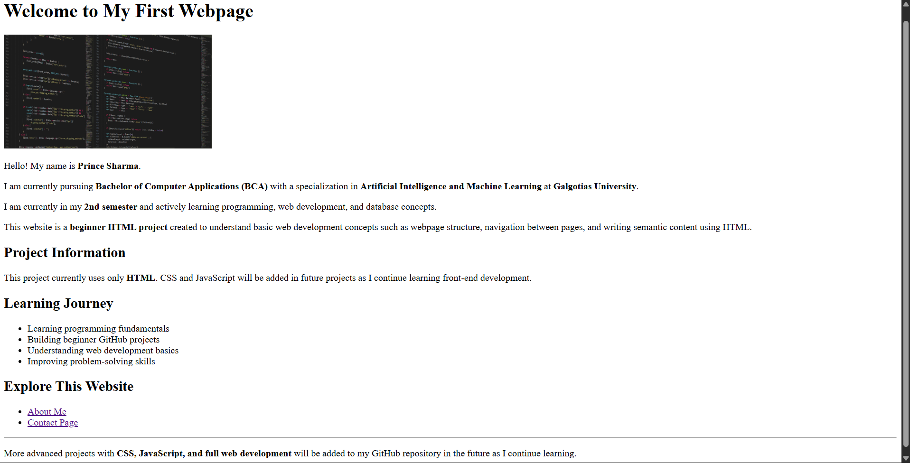
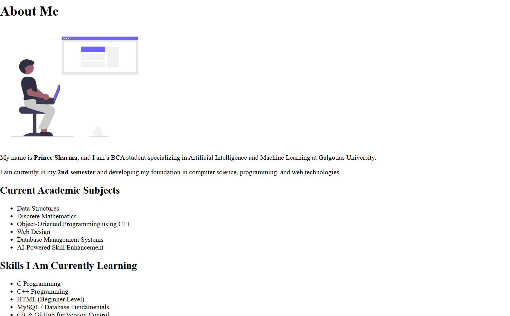
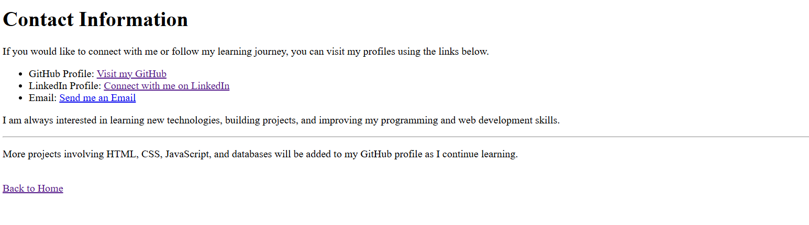

# Beginner HTML Multi-Page Website

This repository contains a beginner-level multi-page website created while learning the fundamentals of web development using HTML.

## Project Overview

This project demonstrates the basic structure of a simple website using HTML.  
It includes multiple pages connected through navigation links to understand how web pages interact with each other.

The goal of this project is to build a strong foundation in web development by practicing HTML page structure, hyperlinks, and basic content organization.

## Website Preview

### Home Page

### About Page

### Contact Page

## Pages Included

- Home Page (index.html)
- About Page (about.html)
- Contact Page (contact.html)

## Project Structure

**html-webpage-beginner**

- 📄 **index.html**
  - Main homepage of the website
  - Contains introduction and navigation links

- 📄 **about.html**
  - Provides academic details
  - Includes semester, subjects, and learning journey

- 📄 **contact.html**
  - Contains contact references
  - Includes LinkedIn, GitHub, and other links

- 📘 **README.md**
  - Documentation explaining the project

- 📜 **LICENSE**
  - Defines project usage permissions

- 🚫 **.gitignore**
  - Specifies files that Git should ignore

- 📁 **images/**
  - Folder containing images used in the project

  - 🖼 **web-dev.png**  
    Development themed image used in the website

  - 🖼 **homepage-preview.png**  
    Screenshot preview of the homepage

  - 🖼 **about-preview.png**  
    Screenshot preview of the about page

  - 🖼 **contact-preview.png**  
    Screenshot preview of the contact page
      

## Technologies Used

- HTML5 (Beginner Level)

Note: CSS and JavaScript will be added in future projects as part of my learning journey.

## About Me

I am currently a **2nd semester BCA student at Galgotias University** specializing in **Artificial Intelligence and Machine Learning**.

I am actively learning programming, database management, and web development while building projects and maintaining my GitHub portfolio.

## Skills I Am Learning

- C Programming
- C++ Programming
- HTML
- MySQL
- Git & GitHub

## Learning Goals

This project helped me understand:

- HTML document structure
- Creating multiple web pages
- Linking pages using navigation
- Organizing files in a project

## Live Website

You can view the live version of this project here:

https://im-princesharma.github.io/html-webpage-beginner

## Future Improvements

Planned improvements for upcoming projects include:

- Adding CSS for webpage styling
- Implementing JavaScript for interactivity
- Learning responsive web design
- Building full-stack web development projects

## Author

Prince Sharma  
BCA Student | Aspiring Software Developer